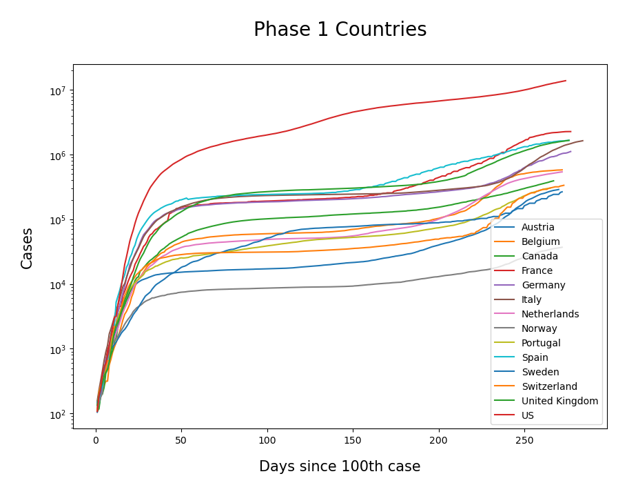
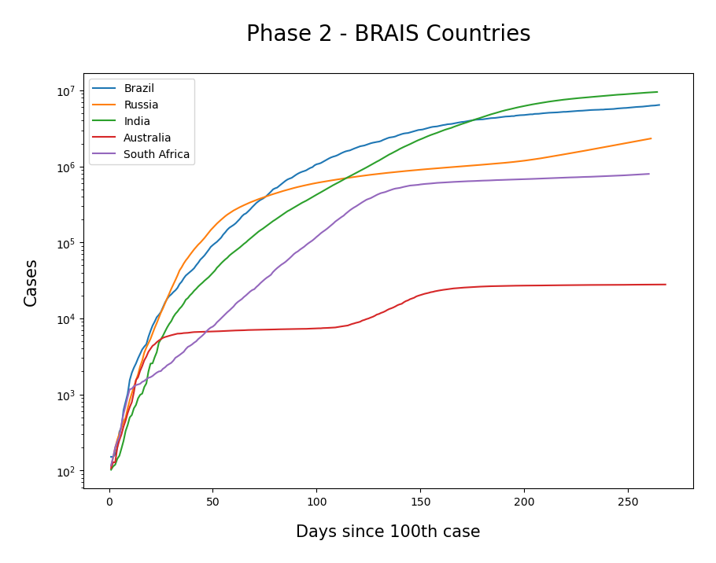
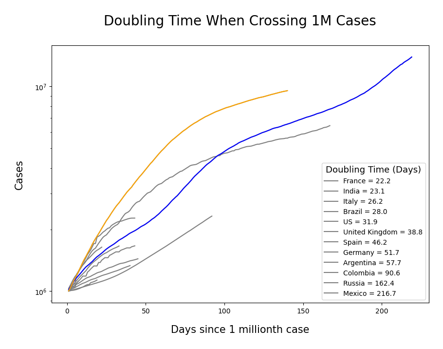

# COVID-19 data analysis
### Shekhar Mishra, Ph.D. [1] and Pranav Mishra, MBBS[2]
[1] Discovery Science, Innovation Management; Naperville, IL, USA.
[2] Kasturba Medical College, Manipal; Manipal, KA, India

We join scientists around the world in analying COVID-19 data. 

### Table 1: Doubling time as the country crossed 1M cases
|Country|Days|
| :----------:  | :----------:  |
France| 22.2|
India|	23.1
Italy|	26.2
Brazil|	28.0
US|	31.9
UK|	38.8
Spain|	46.2
Germany|	51.7
Argentina|	57.7
Colombia|	90.6
Russia|	162.4
Mexico|	216.7