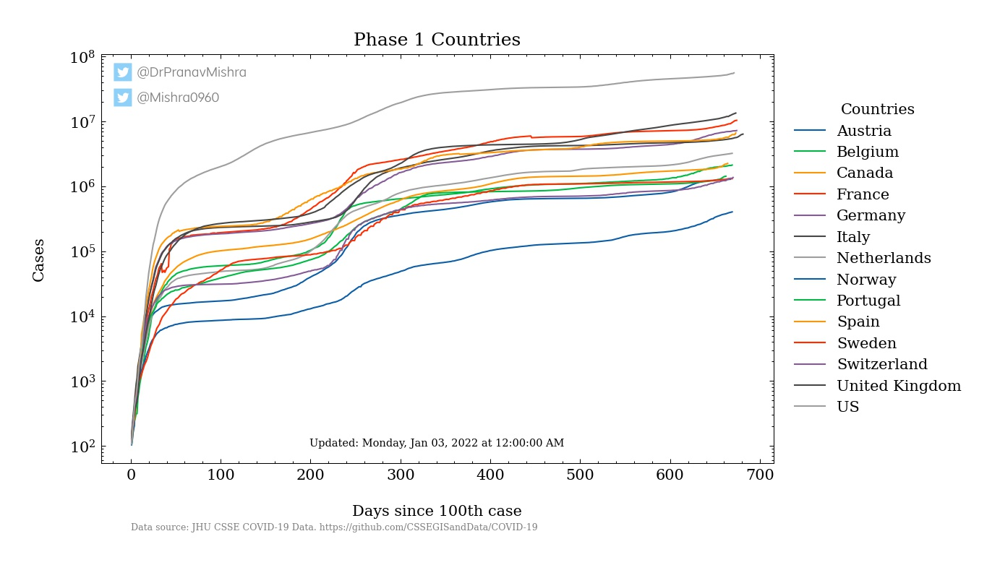
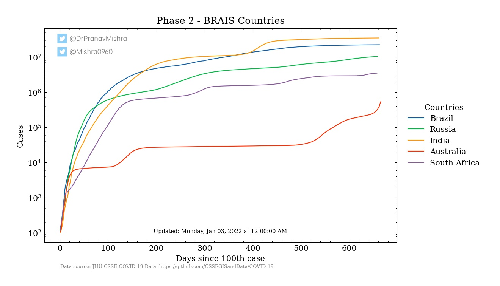
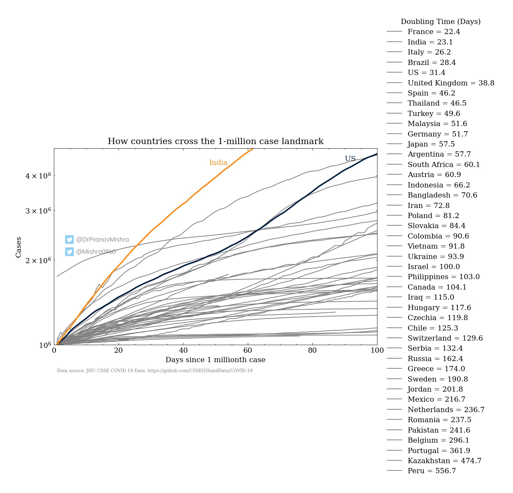
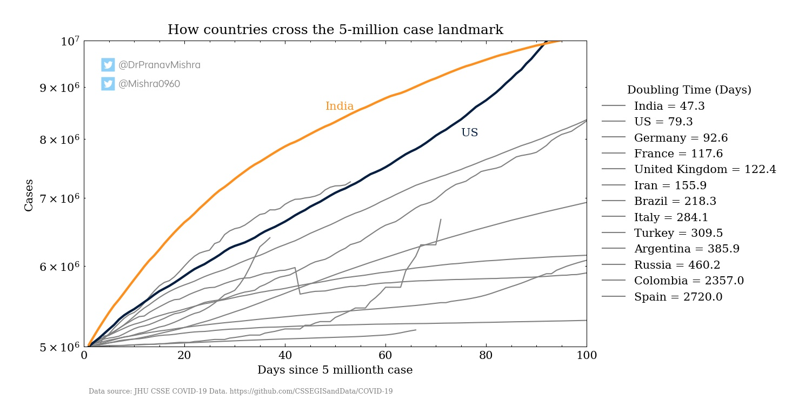
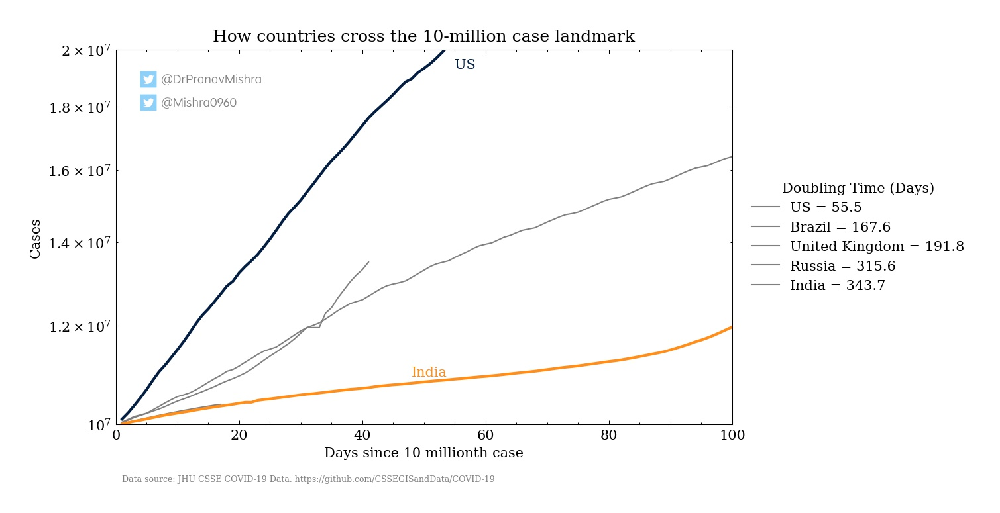

COVID-19 Dashboard
==================
  
### Pranav Kumar Mishra, MBBS [1] and Shekhar Mishra, Ph.D. [2]  
##### [1] Kasturba Medical College, Manipal; Manipal, KA, India  
##### [2] Discovery Science, Innovation Management; Naperville, IL, USA.

  
This repository is an automatically updating working paper. It is published by Zenodo and indexed in openAIRE. Latest version:   
## Dashboard details  
**Latest update from JHU CSSE COVID-19 Data:** Saturday, Oct 23, 2021 at 12:00:00 AM

  
This dashboard file was automatically generated at Sunday, Oct 24, 2021 at 01:00:32 AM. It took 0:00:13.604455 to run.  
## Important Numbers
  
|Country|# Cases | Doubling Time (Days)  
| :----------:  | :----------:  | :----------:  |  
US |45427464 | 445.0  
India |34159562 | 2116.0  

  

  
## Figures

 

**Figure 1 - Phase 1 Expansion of COVID-19 with Models:** We aligned the data from each Phase 1 country, such that t=1 day when the number of cases is closest to, but greater than 100. We include 95% confidence intervals in red, which contain the trajectory of most countries. Disparity is expected near t=1, as countries expand beyond the 100-case cutoff at varying rates. Many reasons exist for early variation in case detection, including, but not limited to, differences in international seeding from China, testing capabilities, healthcare systems, public health policy, including quarantine measures.

 

**Figure 2 - Projection of COVID-19 expansion on Phase 2 BRIAS countries:** This group of countries includes the large developing nations of Brazil, Russia, India, and South Africa. We have additionally included Australia as a country of interest, which escaped the initial international expansion of COVID-19.

 

**Figure 3 - Doubling time at the 1-million case mark:** A number of countries have surpassed the 1-million case mark. The rate at which they cross through the mark varies. A 7-day window doubling time was calculated as each of the countries above crossed 1 million cases of COVID-19. A smaller doubling time indicates rapid disease expansion, whereas a longer doubling time indicates slower expansion.

 

**Figure 4 - Doubling time at the 5-million case mark:** A number of countries have surpassed the 5-million case mark. The rate at which they cross through the mark varies. A 7-day window doubling time was calculated as each of the countries above crossed 5 million cases of COVID-19. A smaller doubling time indicates rapid disease expansion, whereas a longer doubling time indicates slower expansion.

 

**Figure 5 - Doubling time at the 10-million case mark:** A number of countries have surpassed the 10-million case mark. The rate at which they cross through the mark varies. A 7-day window doubling time was calculated as each of the countries above crossed 10 million cases of COVID-19. A smaller doubling time indicates rapid disease expansion, whereas a longer doubling time indicates slower expansion.

.jpg) 

**Figure 6 - Distribution of doubling times:** As different countries implement different disease mitigation strategies, the rate of expansion within each country varies. A histogram is created of case doubling times, in days, for each country.  
# License  
The content of this project itself is licensed under the Creative Commons Attribution-ShareAlike 4.0 International (CC BY-SA 4.0) license, and the underlying source code used to format and display that content is licensed under the MIT license.  
### Content License  

 
   
 
 
 COVID-19 Analysis by [Pranav Mishra and Shekhar Mishra](https://github.com/pranavmishra90/COVID-19) is licensed under a [Creative Commons Attribution-ShareAlike 4.0 International License](http://creativecommons.org/licenses/by-sa/4.0/).  
### Software License  
MIT License - Copyright (c) 2020 Pranav Mishra and Shekhar Mishra